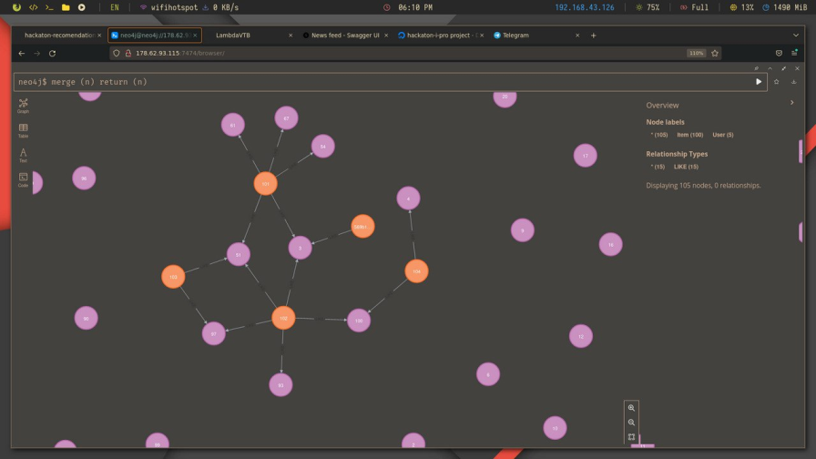
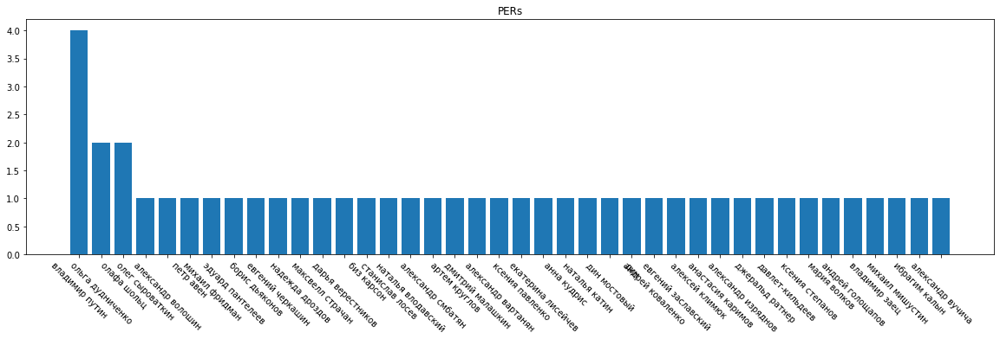
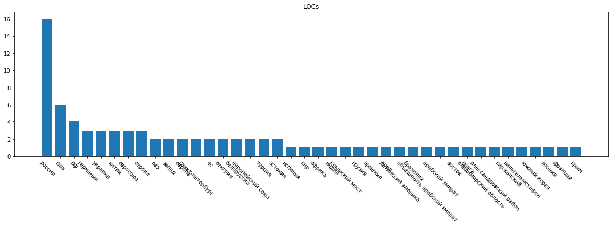
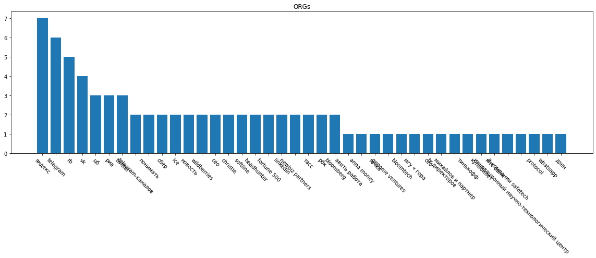
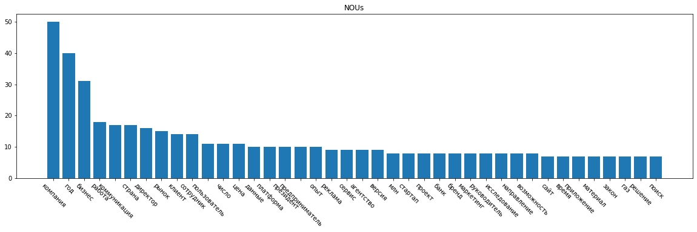
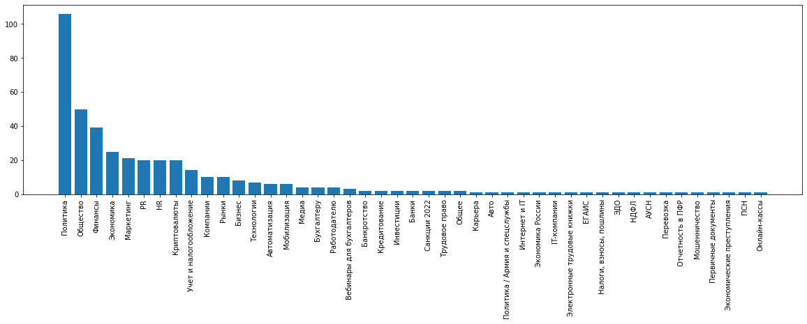

# Почемучки или почему система такая какая есть

## Основные репозитории проекта

- [Бекенд, запуск проекта](https://github.com/LambdaVTB/backend-bundle)
- [Фронтенд, мобильный интерфейс](https://github.com/LambdaVTB/flutter-frontend)
- [nlp-workbench, место, где собраны ноутбуки](https://github.com/LambdaVTB/nlp-workbench) -- Почемучки <-- Вы тут

## Оглавление

- [Почемучки или почему система такая какая есть](#почемучки-или-почему-система-такая-какая-есть)
  - [Основные репозитории проекта](#основные-репозитории-проекта)
  - [Оглавление](#оглавление)
  - [Почему использовали именно Natasha?](#почему-использовали-именно-natasha)
  - [Определение дайджеста - scripts/rss_parser.py](#определение-дайджеста---scriptsrss_parserpy)
  - [Рекомендательная система](#рекомендательная-система)
  - [Суммирование дубликатов](#суммирование-дубликатов)
  - [Определение трендов - scripts/get_trends.py](#определение-трендов---scriptsget_trendspy)
  - [Определение инсайтов - scripts/insight_miner.py](#определение-инсайтов---scriptsinsight_minerpy)
    - [Почему twitter?](#почему-twitter)
    - [Почему WIP?](#почему-wip)
  - [Отбор источников](#отбор-источников)
  - [Взгляд в будущее](#взгляд-в-будущее)
  - [В чем плюсы решения?](#в-чем-плюсы-решения)
  - [Остались вопросы?](#остались-вопросы)
  - [lambda() - это мы](#lambda---это-мы)

## Почему использовали именно Natasha?

Авторы этих моделей специально проводили квантизацию чтобы ускорить модель в несколько раз и в итоге все необходимые веса в сумме занимают менее 100Мб. Более того это значительно ускоряет саму модель, позволяя обрабатывать большое количество потоков информации даже на не высокопроизводительных серверах.

Модели, представленные в данной библиотеки были обучены на корпусе из русских новостей, что соответствует нашей задаче. "Для новостных статей качество на всех задачах сравнимо или превосходит существующие решения. Библиотека поддерживает Python 3.5+ и PyPy3, не требует GPU, зависит только от NumPy. " - утверждают авторы на главной странице.

Более того, решение имеет подробную документацию и имеют активное комьюнити разработчиков.

## Определение дайджеста - [scripts/rss_parser.py](scripts/rss_parser.py)

Сайты с RSS-фидами —> Ежедневное обновление последних новостей

В результате формируется локальная база новостей —> Новости за последнюю неделю —> Борьба с дубликатами —> Фильтрация по тегам (каждая новость имеет тег, определяющий тематику, набор тематик для роли захардкожен) —> Сортировка по дате + рекомендации от рекомендательной системы, реализованной на графах по последнему месяцу.

По функционалу схоже с дайджестом новостей на yandex.ru

## Рекомендательная система

Рекомендательная система реализована на графах. По каждой новости строится граф, в котором вершины — это пользователи, а ребра — это заход пользователя на новость. По графу строится  представление новости. По этому представлению строится рекомендация. Подробную реализацию можно посмотреть в репозитории [бекенда](https://github.com/LambdaVTB/backend-api-employee/blob/main/service/endpoints/news.py).

## Суммирование дубликатов

При обработке входящего потока новостей, новые новости сравниваются с уже имеющимися в базе. Если новость уже есть в базе, то теги новостей конкатенируются, ссылки на источники тоже. Оставляется первый заголовок и дата. Таким образом, две или более одинаковые новости сливаются в одну.

Определение является новость дубликатом или нет происходит на [бекенде](https://github.com/LambdaVTB/backend-api-employee).

Являются новости дубликатами, или нет, определяется на основе заголовка. Иползуется полнотекстовый поиск по базе новостей для поиска кандидатов для сравнения. После этого происходит сравнение заголовков. Если заголовки совпадают, то новость считается дубликатом. Если нет, то новость не считается дубликатом. В более редких случаях
дубликатов, новости отличаются совсем немного, поэтому заголовки, между которыми расстояние Левенштейна невелико, считаются дубликатами.

## Определение трендов - [scripts/get_trends.py](scripts/get_trends.py)

1. Возможность определять общие тренды - тренды по всем новостям - `get_trends`

Набор новостей за последние n дней —> Из заголовков выделяем Named Entities (названия и имена), и отдельно другие существительные  —> Считаем кол-во NE, получаем самые упоминаемые, а значит популярные места (LOCs), людей (PERs), организации (ORGs),  и вещи (NOUs) за последнее время  —> это и есть тренд

2. Возможность определять тренды по ролям - профильные тренды - `get_trends_by_tag`

Для составления профильного тренда мы фильтруем новости по тегу, и считаем тренды только по новостям с этим тегом. Таким образом, мы получаем тренды по тематике, которая интересует нас.

В целом,
Трендом становится слово, человек, место, словосочетание или организация, которые встречаются в заголовках новостей чаще других в последнее время.

Примеры полученных трендов приведены ниже.

Тренд по людям:

Тренд по локациям:

Тренд по организациям:

Тренд по другим существительным:

Проверить можно в [конце этого ноутбука в разделе prod](notebooks/TIS_defining_whats_in_trend.ipynb).

## Определение инсайтов - [scripts/insight_miner.py](scripts/insight_miner.py)

1. Инсайт - Аналитика и полезные материалы

Тренды по тегам —> Поиск статей на vc.ru, habr.com, других блогоподобных площадках, где люди высказывают аналитику и свое мнение —> Полезные материалы

2. Инсайт - Мнение общества (WIP/Planned)

Тренды по тегам —> Поиск упоминаний этого слова в твиттере (через поиск твиттера) —> Конкатенация всех мнений —> Суммаризация мнений с помощью нейронной сети —> Короткий текст, отражающий отношение людей к тренду

### Почему twitter?

- Международная платформа
- Широкие возможности для фильтрации по кол-ву лайков \ языку \ отклику людей \ региону \ тд тп
- Можно выделить список аккаунтов-авторитетов \ лидеров мнений
- Можно выделить подтвержденные аккаунты как в целом формулирующие мнение
- Здесь люди стремятся высказать свое мнение, поучаствовать в дискуссии, при этом посты сильно связаны друг с другом

### Почему WIP?

- Сложно подключиться
- Отсутствует API и поэтому трудности в парсинге (!!!)
- Однако проблемы нивелируются, если получить twitter developer аккаунт
- Пайплайн рабочий, если удается получить твиты и дает хорошие результаты, но пока не реализовано из-за отсутствия API

## Отбор источников

При выборе метода получения информации мы руководствовались тем, что хотел получить масштабируемую систему с максимальной простотой интеграции новых источников.

Как следствие - наш выбор пал на источники, предоставляющие каналы RSS. Это стандартизирован канал новостных блогов, поддерживающий теги.

Стоит отметить, что не все источники имеют теги. В дальнейшем развитии системы для решения этой проблемы можно обучить нейросеть, которая бы определяла к какому  тегу относится новость. (у нас не реализовано)

Поскольку нам было необходимо продемонстрировать работоспособность системы и возможность персонализированных рекомендаций по ролям - мы выбрали источники про бизнес, финансы, бухгалтерский учет, и несколько общих. Такой выбор позволяет проверить работоспособность системы при пересекающихся тегах у ролей, при не пересекающихся.

Пройдемся по каждому источнику:
    - Источники, подошедшие для бухгалтера:
      - <https://buh.ru/> - интернет ресурс для бухгалтеров
      - <https://klerk.ru/> - качественный сервис для бухгалтеров с полезными статьями и новостями
      - <https://audit-it.ru> - актуальные новости и статьи для бухгалтеров
    - Источники, подошедшие для гендира:
      - <https://www.rb.ru/> - секции pr, fintech, hr, crypto, marketing
      - <https://finance.rambler.ru/> - finance, business, markets
    - Общие:
      - <https://www.vedomosti.ru/rss/news> - новости

Список источников, которые бы составили хороший материал для рекомендаций, но не были использованы в рамках хакатона:

- <https://www.forbes.ru/new>
- <https://russian.rt.com/tag/biznes>
- <https://www.gazeta.ru/business/>
- <https://www.rbc.ru/business/>

RSS-каналы были получены с помощью библиотеки feedparser. В момент получения новостей, они проходят через фильтр, который удаляет новости, которые уже были получены ранее. Таким образом, мы получаем только новые новости. Новости приходят с тематическими тегами, и было бы интересно посмотреть на их распределение, учитывая то, что мы используем несколько источников.

При получении RSS-каналов с помощью библиотеки feedparser мы получили 410 новостей, распределение по тегам следующее:

Видно, что есть перекос в сторону некоторых тегов, в этом нет ничего страшного. В целом можно сказать, что теги разнообразные. Также стоит отметить, что в рамках хакатона мы не стали использовать большое кол-во источников. С увеличением кол-ва источников, мы получим больше новостей, и распределение по тегам будет более равномерным.

Что же касатся наполнения базы тестовыми данными в интернете два варианта:

- РИА новости за 4 года - тегов нет - <https://github.com/RossiyaSegodnya/ria_news_dataset>
- Лента.ру за 2 года - есть тематические теги, не трендовые - <https://www.kaggle.com/datasets/yutkin/corpus-of-russian-news-articles-from-lenta>

Остановились на втором варианте, срез можно найти в репозитории в папке [с артефактами](/artifacts/).

## Взгляд в будущее

- Подключить больше источников новостей
- Подключить больше тегов
- Обучить нейросеть для определения тега входящей новости, чтобы обрабатывать источники без тегов
- Использовать TF-IDF, чтобы отбрасывать неважные слова при формировании трендов
- Расширить инсайты

## В чем плюсы решения?

- Система не зависит от человека, она сама формирует тренды
- Можно подключать новые источники новостей
- Можно подключать новые теги
- Решение очень малозатратное по необходимой памяти для весов - до 90 Мб
- Решение не требует обучения, достаточно просто запустить

## Остались вопросы?

- Обращайтесь к нам! Мы всегда рады вам помочь и объяснить.

## lambda() - это мы

- Лебедева Татьяна - мобильный разработчик
- Голубев Егор - бекенд разработчик
- Тампио Илья - ML разработчик
- Денис Лахтионов - дизайнер
- Егор Смурыгин - менеджер
